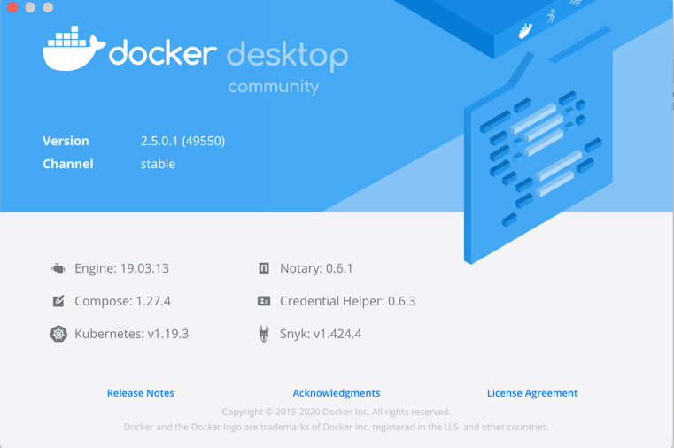
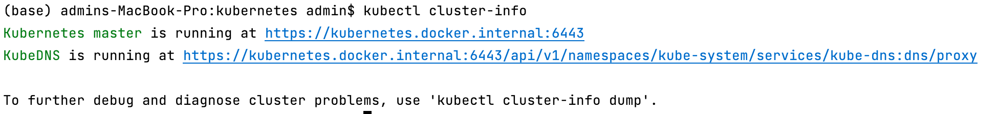
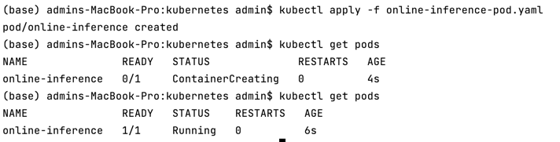
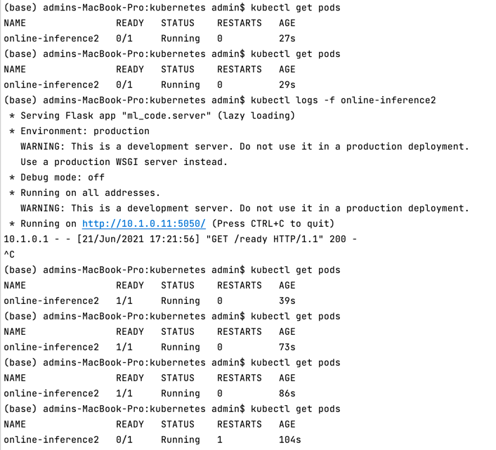
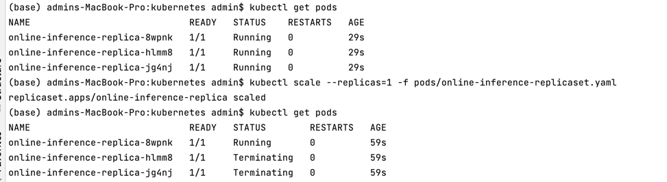
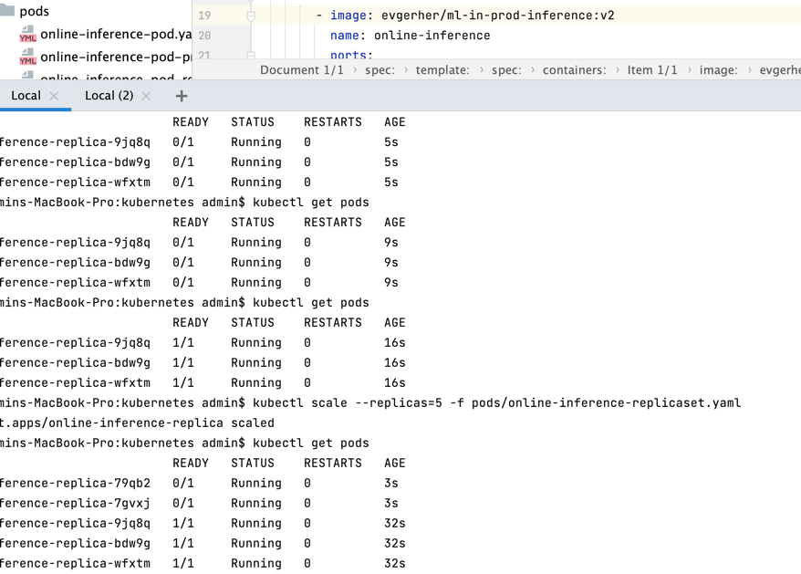

# Homework 4. Kubernetes
0) + Использованный kubernetes cluster: `Docker Desktop -> Kubernetes`  

---
1) **(+5)** Console command `kubectl cluster-info`

---
2) **(+4)** Поднятый под

   a) **(+2)** Устанавливая ограничения на ресурсы мы добиваемся двух вещей:
    1) Наше приложение не сможет сожрать ресурсы всего кластера (а лишь разумные пределы) - упадет в крайнем случае оно, а не кластер.
    2) kubernetes-master или scheduler сумеет выбрать подходящую машину под наши потребности
---
3) **(+3)** Модифицируйте свое приложение так, чтобы оно стартовало не сразу и падало спустя минуты работы.  
   - Liveness сообщает актуальный статус пода - отвечает ли он на запросы (превышает время ответа) или нет. Крайне важен при работе больших индустриальных проектов - вовремя заметить и заменить погибший инстанс приложения. 
   - Readiness сообщает готов ли инстанс к работе - начиная с какого момента можно роутить запросы в этот инстанс (подменить старый инстанс новым). Обычно ожидаем загрузки всех внешних зависимостей и инициализации баз данных. В нашем случае - модель.

Sleep 20 seconds, shutdown after 60 seconds.  
Readiness/liveness once per 3 sec, delay 10 sec.  
[Updated image](https://hub.docker.com/layers/evgerher/ml-in-prod-inference/v2/images/sha256-1270eff7b846049af1ea10574b597fd50e2a5458295d3c2e109a0454c25b5d6f?context=repo)  

  

4) (+3, но не факт - может я напартачил) Создайте replicaset

Обнволение версии 0.0.2 -> v2 

Upscale: 3 -> 1

- Осталась одна из старых (новая версия не подхватилась)
 
  
Downscale 3 -> 5

- Остались работать старые версии (даже в доп репликах)
 
  
5) (+0 баллов) SKIPPED
